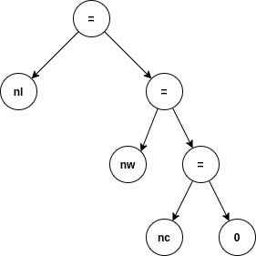
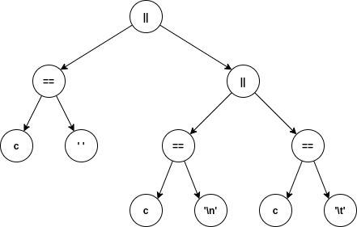

5) Máquinas de Estado — Palabras en Líneas
==========================================

Arboles de expresion
--------------------

<u>Expresion de asignacion:</u>

<u>Expresion de comparacion:</u>

Maquina de estado como n-upla
-----------------------------

La maquina M se define como una 5-upla (Q, E, F, q0, T), donde:
* Q = {IN, OUT, f} es el conjunto de estados posibles del automata
* E = ASCII + EOF es el conjunto de posibles entradas del lenguaje que acepta el automata
* F = {f} es el conjunto de posibles estados terminales del automata
* q0 = IN es el estado inicial del automata
* T es la funcion de transicion de estados del automata, definida como:

|T|char|' '|\n|\t|EOF|
|---|------|---|---|---|---|
|IN|IN|OUT|OUT|OUT|f|
|OUT|IN|OUT|OUT|OUT|f|
|f|-|-|-|-|-|

## Ventajas y desventajas: enum/switch

||K&R: if|Implementacion #1: enum/switch|
|---|---|---|
|Ventajas|Performance, velocidad de escritura|Claridad del codigo, facilidad de mantenimiento/escalabilidad|
|Desventajas|Poca claridad, dificil de manejar casos extras|Perdida de performance (aunque no sea notable en la vasta mayoria de los casos). Requiere mas "boilerplate" al tener que definir estructuras nuevas como un enum|

## Uso del GOTO:

Los lenguajes modernos que valoren la seguridad de ejecucion intentan no implementar goto, o saltos incondicionales en su totalidad. Un ejemplo de esto es Rust, en el cual `goto` ni siquiera se considera una palabra reservada del lenguaje.

Si bien goto ve usos en el desarrollo moderno (ejemplo, iOS), esto muchas veces conlleva a fallas criticas de ejecucion, que pueden desembocar en fallas de seguridad de datos (https://www.imperialviolet.org/2014/02/22/applebug.html publica un write-up sobre un error de este tipo en versiones viejas de iOS)
