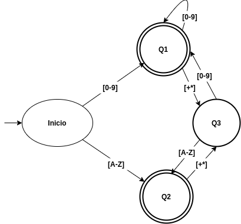

Calculadora Infija: Construcción Manual
=======================================

Especificacion lexica:
----------------------

* NUMBER: Un numero en base decimal
* VARIABLE: Una letra del alfabeto
* OPERATOR: Un operador "+" o "\*"
* END: Un fin de linea
* INVALID: Un caracter fuera de este ambito

Maquina de estado del parser
----------------------------

